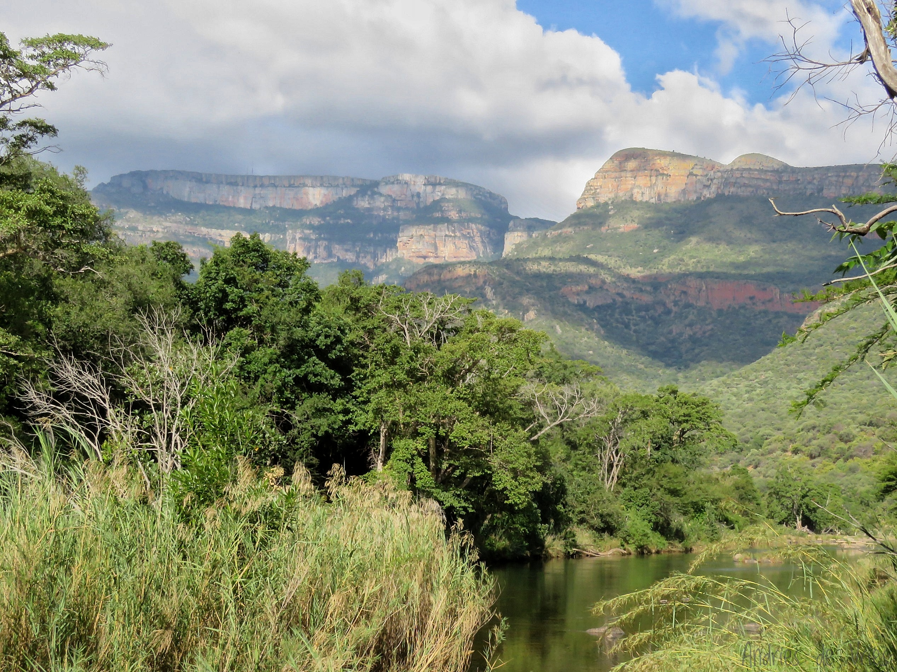
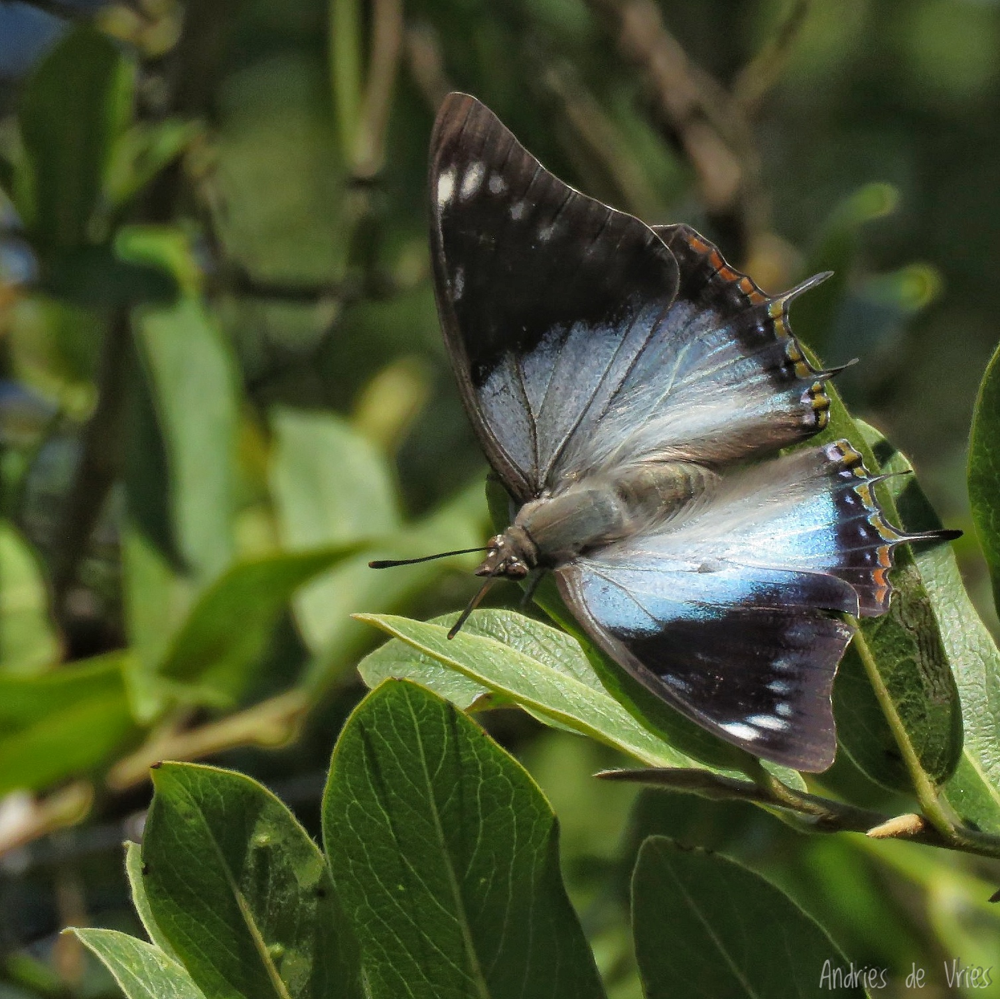
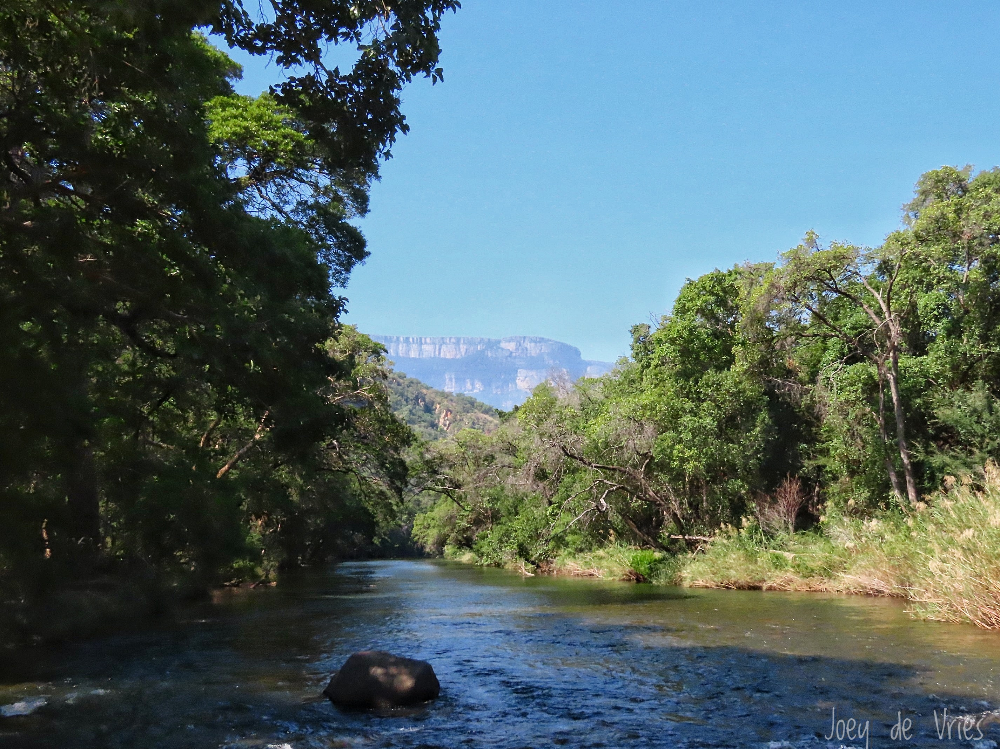

# Swadini Biodiversity Project

Swadini is situated in the Blyde River Canyon in Mpumalanga, 
South Africa — one of the country's most biodiverse hotspots.

This page presents citizen science data collected over multiple survey 
seasons, analysed and presented in collaboration with Claude AI.

---

## 🦋 Butterflies
- [Butterflies Dashboard](swadini-butterflies-dashboard.html)
- [Butterflies Report](swadini-butterflies-report.pdf)

## 🪲 Odonata (Dragonflies & Damselflies)
- [Odonata Dashboard](swadini-odonata-dashboard.html)
- [Odonata Report](swadini-odonata-report.pdf)

## 🐦 Birds
- *Dashboard and report coming soon*

## 🌦️ Climate
- [Rainfall Dashboard](swadini-area-rainfall-dashboard.html)
- *Temperature dashboard coming soon*

---

## About Swadini

Swadini lies on the western bank of the Blyde River within the Blyde River Canyon, one of the Top-10 largest canyons on earth, and certainly one of the most spectacular samples of natural beauty, wildlife diversity and special geological composition. The varied topography, 
altitude gradients and proximity to the lowveld ensure an area of unique fauna and flora.

Some of the endemic and rare species found in the area are:  
Marieps Charaxes butterfly (_Charaxes marieps_)  
Blyde River Aloe (_Aloe integra_)  
Eastern Scissortail dragonfly (_Microgomphus nyassicus_)  

A new four-month biodiversity survey is planned for May 2026.

---

*Data and reports updated regularly. All records contribute to 
citizen science databases.*

[← Back to Bosloper Home](../../index.md)
